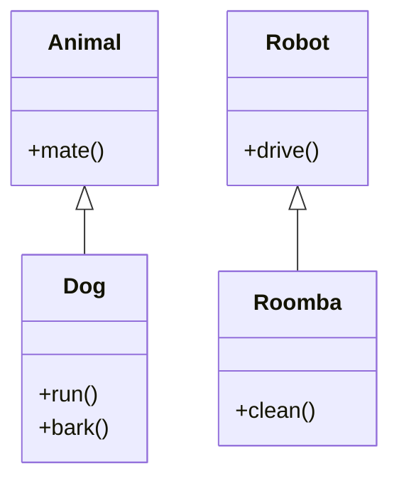
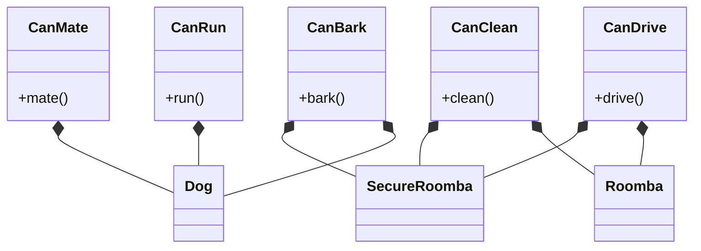

Composition is a method of writing code in object-oriented programming. It attempts to solve the same problem as [[Inheritance]], but instead of relying on inheriting features from the parent class, composition focuses on embedding objects inside of objects to allow the sharing of functionality.

While designing with Inheritance in mind, we are constantly trying to answer the question `what objects are?`. Composition on the other hand focuses on a different question - `What objects do?`. Composition over inheritance is a principle that

Let's look at a simple problem and how we'd first solve it with Inheritance. We want to represent some animals and robots in our application. 

Dog is an animal that can bark, and Roomba is a robot that can clean - simple!
Now imagine a Roomba which is also designed to keep your home both clean and safe, by being able to bark while cleaning. I'm sure we'd find a solution to this problem with inheritance, but composition makes this much more simpler. 

We define reusable behaviours separate from their owning objects, which allows us to easily create a `Roomba` that `CanBark`, or even a `Dog` that `CanClean`! 

Sometimes, it's really useful to just be able to drop the labels - what you are doesn't have to define what you can do! jk lol

-----

Status: #🌱 

References:
- 
