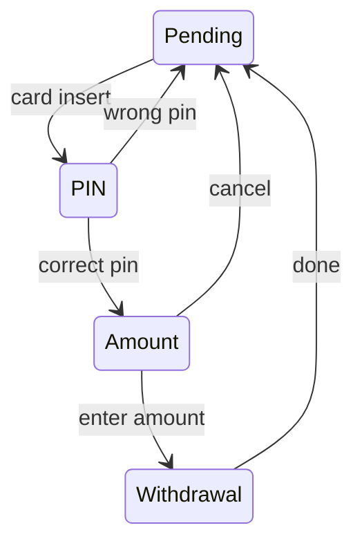

One of the most well-known [[Design Pattern]] in computer science. It's useful when we see a system having a number of different states it can be in, with specific rules of which states can be accessed from which states. It's called a finite state machine, because it defines a finite number of possible states the machine can be in.

A good example of a state machine is ATM:
- when you approach it, it's in sort of a "pending" state, showing some adverts and waiting for a user to insert a card
- once a card is provided, it now asks for a pin code
- if pin code is not entered correctly a couple of times, ATM goes back to the initial pending state
- if pin code is correct, it shows you the "withdraw amount" screen
- after you enter the valid amount, ATM goes into "withdrawal in progress" screen, gives you the money and your card back, and returns to the "pending" state 

This allows you to control the flow of the application in a way that easily makes sure that you can't do things like access Amount screen before providing the PIN, as well as that you cant go back to the PIN screen once you have entered the correct one.

One of the problems with state machines is that they don't remember previous states, which can be important if we wanted to transition to a temporary state after which we wanted to go back to the original one - we can't do that if we don't know from where we came. This problem is easily solved by an implementation variation called [[Pushdown Automata]].

-----

Status: #🌱 

References:
- 
