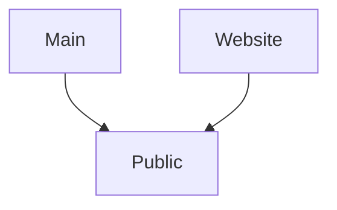

This is a quick walkthrough of how I manage and publish my notes.

## Goal

The goal of this whole project is for me to have a good way to manage my knowledge base and easily publish some subset of it.

The notes should be stored in markdown format in [[Public/Git]], and published by Github Pages. It's important that I can easily publish or unpublish notes from the website as needed.

Note taking itself is inspired by [[01 Inbox/Evergreen Notes]] method. 

## Implementation

The setup consists of three github repositories which are interconnected by [[01 Inbox/Git Submodules]]:
- `Main` repository
- `Public` repository - https://github.com/hpdobrica/digital-garden-public
- `Website` repository - https://github.com/hpdobrica/hpdobrica.github.io

### Main repository

Main repository has 4 folders:
- Inbox (where new notes end up)
- Private (notes I don't want to publish)
- Public (notes I want to publish)
- Templates (for easier note creation)

The Public folder is set up as a submodule pointing towards `Public` repository. This means that whenever something is added to Public folder, it's not actually stored in the `Main` , but  in the `Public` repository.

The rest of the folders are pretty much normal folders containing Markdown files. Obsidian has a Git plugin which pushes the changes made to both root repository and the submodules, so the integration works seemlessly.

This way the `Main`  repository is the only repository I actually use - `Public` repository is never touched directly, so all my notes are in one place.

### Website repository

The `Website` repository is set up as a Github Pages hosting, and basically contains only https://jekyll-garden.github.io/ theme, with `Public` repository linked in as a submodule.

This repository is only edited for the static content, Public submodule is never touched directly.

### Public repository

 `Public` repository is being written and read by the `Main` repository, and read by the `Website` repository. No modifications are ever done to it directly.
 
 The last piece to the puzzle is also located within this repository: I have set up a Github Action that triggers on every change of main branch of `Public` to trigger a submodule update within `Website` repository. 
 
 This means that whenever i change something in `Main`'s Public folder', the change gets pushed to `Public`, where it's picked up by Github Action and propagated to `Website`.

-----

Status: #🌲 

References:
- [[Initializing this project]]
