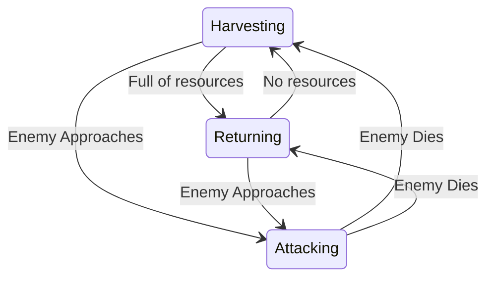

Pushdown Automata is an implementation of a [[Finite State Machine]] [[Design Pattern]] which uses a [[Stack]] [[Data Structure]] to store it's states.

The top of the stack represents the currently active state, while the one below it is the state that we just transitioned from. While with the default FSM setup transitioning to previous state would be impossible, with Pushdown Automata it's a matter of popping the currently active state.

An example where this would be useful is if we were working on an NPC AI in [[Game Development]] where this NPC harvests a resource (`Harvesting` state) and brings it back home once they have enough (`Returning` state). If an enemy approaches, we will push the Attacking state on top of the stack. If the enemy runs away or dies, we can just pop the Attacking state, and the NPC will go back to either `Harvesting` or `Returning`, depending on what he was doing before the enemy appeared.

-----

Status: #🌲 

References:
- 
