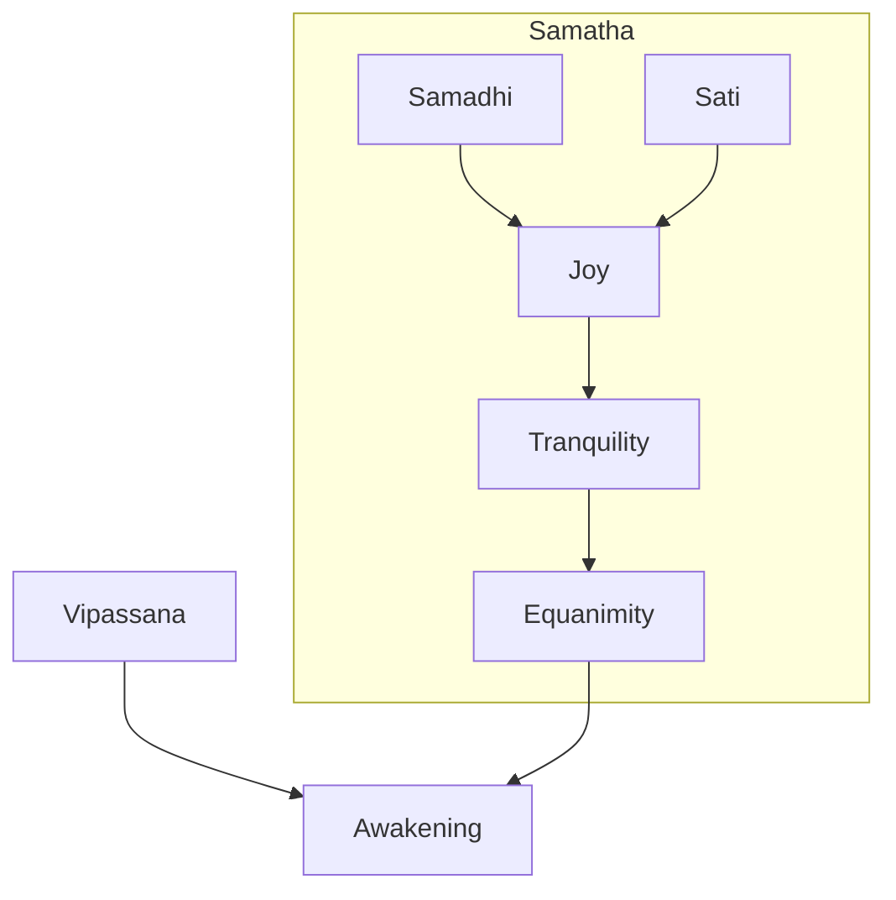
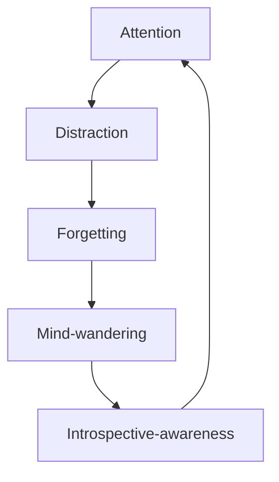

Source: [The Mind Illuminated](https://www.goodreads.com/en/book/show/25942786-the-mind-illuminated)
Status: #🛈/📖/🚧

---

## Introduction

- "The beauty and significance of life well lived consists not in the works we leave behind, or in what history has to say about us. It comes from the quality of concious experience that infuses our every waking moment, and from the impact we have on others."
- Our personal reality consist of a stream concious experiences,[]() which in themselves consist of thoughts, sensations, emotions, as well as our reactions and responses to them.
- Meditation gives us tools to examine and work with our concious experience.
- Meditation works by teaching our minds that we can live more conciously than we do by default. Then, through appropriately directed concious activity, it allows us to get a better understanding of our minds, world aroud us and relaity.
- The knowledge granted by practicing meditation is intuitive in nature, and simply knowing it intelectually is not enough to unlock it's benefits - it must be gained directly through observation and experience. 
- This is important because actual happiness can only come from within - unless our mind is in order, nothing outside of it will make much impact on our happiness for a significant period of time (https://www.youtube.com/watch?v=6Y4fE1tmy6Y)
- Final goal of meditation is attaining [[Awakening]] - the attainment of genuine wisdom - removal of ignorance through direct experience.
- This book is aimed to be a comprehensive guide for meditation.

Modern road map for meditation:
- A lot of literature serving as meditation guide exists, but much of it is cryptic and unaproachable, especially to the western practicioners.
- This book is modernization/fusion of various traditional teachings. It does not reflect one Buddhist tradition in particular.
- The base of the book is taken from Asanga's nine stages (with the first one of actually developing consistent practice being added), creating ten stages of progress in meditation that this book uses as "map" for the meditative journey.
- A map like this requires a specific vocabulary to help us describe our practice

Putting this practice into context:
- wide range of practice types:
	- tibetan emphasizes vizualizations and sophisticated analytical methods
	- zen strips everything down to "just sit"
- book tries to make sense of all different approaches, without rejecting any of them
- terms that are important to understand, how they relate to each other and to the goal of Awakening:
	- `samatha` (tranquility or calm abiding)
	- `vipassana` (Insight)
	- `samadhi` (concentration or stable attention)
	- `sati` (mindfulness)
- Awakening requires a profound shift in our intuitive understanding of the nature of reality
- Awakening is a cognitive event, the culminating insight in a series of special insights called `vipassana`.
- This climax of progress of insight only occurs when the mind is in a unique mental state called `samatha`. `Samatha` and `vipassana` are both generated using `samadhi` (stable attention) and `sati` (mindfulness).
- Although its possible to cultivate `samatha` and `vipassana`  separately, both are necessary for awakening

- `Samatha` consists of five characteristics:
	- Effortlessly stable attention (`samadhi`)
	- Powerful mindfulness (`sati`)
	- Joy
	- Tranquility
	- Equanimity
- State of `samatha` results from working with stable attention and mindfulness until joy emerges. Joy gradually matures into tranquility, from which arises equanimity. Muind in `samatha` is in ideal state for achieving Insight (`vipassana`).
- `Vipassana` refers specifically to insight into the true nature of reality that radically transforms our understanding of ourselves and our relationship to the world.
- In addition to `vipassana`, meditation also produces many other useful "mundane insights" like better understanding of:
	- our own personality
	- social interactions
	- human behavior
	- how everyday world works
- However useful they might be, they are not `vipassana` if they don't impact us or our upderstanding of reality in a profound way
- `vipassana` insights are not intelectual but deeply intuitive in nature
- Five most important `vipassana` insights are insights into:
	- impermanence
	- emptiness
	- nature of [[Suffering]]
	- interdependence
	- illusion of separate self
- First four of these insights can be achieved by `samadhi` and `sati` alone
- final, no-self insight requires the mind to be in state of `samatha` - filled with deep tranquility and equanimity. This final Insight represents the Awakening
- Many meditation traditions separate stable attention (`samadhi`) and mindfulnes (`sati`), linking concentration practice exclusively to `samatha` and mindfulness practice directly to `vipassana`
- This approach emphasizes mindfulness at the expense of stable attention and vice versa:
	- stable, hyper-focused attention alone leads to a state of blissful dulness (a complete dead end)
	- midfulness is impossible to achieve without a degree of stable attention - without stability, mindfulness is mostly mind-wandering, discomfort, drowsiness and frustration
- instead, these two skills should be cultivated together like two wings of a bird that flies towards `samatha` and `vipassana`.
- brief episodes of `samatha` can occur long before you becoma adept practitioner. Insight can happen at any time as well. Because of this, temporary convergence of `samatha` and `vipassana` can lead to Awakening in any stage. This makes the event of awakening somewhat unpredictable - on the other hand, as you progress through stages, the likelihood of it happening increases
- 10 stages presented in this book are a systematic approach for developing `samatha` and `vipassana` together
- therefore the most accurate description of this method is `samatha-vipasssana meditation` - the practice of tranquility and insight
- these techniques don't have to replace any other techniques, they can complement the ones you already do - ten stages can be used with any of the Mahayana or Theravada practices.

How to use this book:
- divided into stages:
	- first interlude lays the groundwork for practice
	- second interlude introduces you to the hindrances and problems youll face in your practice
	- third one explains how mindfulness works
	- fourth and fifth introduce a more in-depth models of mind (moments-of-conciousness and mind-system models)
	- sixth lays foundation for stages seven through ten
	- seventh provides further refinements to the models of the mind
- this book can be read front to back, or it can be used as a reference guide
- if you find yourself adrift, re-read the chapter overview of the ten stages
- consult standalone appendices as needed

## An Overview of the Ten Stages
- ten stages, with four milestones which divide them into four distinct parts, this can help you figure out where you are and how to continue
- dont force your experience into something you read - use what you read to guide and understand your own experiences - no matter what forms they take
- revisit this chapter to keep the image fresh in your mind

How the process unfolds:
- each of the stages represents a skill you have to master. Once you master one stage, you can proceed to the next one, as skills build on top of each other
- to make progress you should:
	- determine the current stage
	- work with the techniques for that stage
	- once mastered, move on to the next stage
- the process is not so linear, some stages will be worked on together, you will be moving between different stages throughout several sits, and even during a single sit
- you might fall back to lower stages or jump up to higher ones unexpectedly, whatever happens just practice based on the current stage
- techniques in several stages might be the same, but their goals are different
- progressing from stage three to four might take much longer time than progressing from four to five
- any advanced meditation experiences during lower stages should be looked at as inspiration and as a demo of whats to come - continue practicing on your current stage
- the goal is not to get a certain kind of meditation experience randomly - it is to be able to consistently reproduce it

The rate of progress through the ten stages:
- its possible to master the stages between several months and several years
- one to two hours of daily practice
- no month or year long retreats are necessary - diligent daily meditation, along with occassional longer periods of practice are enough
- progress in meditation is influenced by whats happening outside of it, many things can set you back (job loss, sickness, death of a close person)
- separation of meditation and daily life is another hindrance to progress - we should aim to use the skills learned through meditation in our daily lives
- if these skills dont infuse our daily lives, practicing will be like filling a leaky bucket

The ten stages of meditative training:
- novice: 1-3
- skilled: 4-6
- stage 7 is transition stage
- adept:8-10

- stage one: establishing a practice
	- this stage is about developing consistent and diligent meditation practice
	- consistent meaning to set clear schedule for when you are going to meditate, and stick to it except in the circumstances that are out of your control
	- diligent meaning that practice time is spent wholeheartedly practicing and not planning and daydreaming
	- its **goal** is to develop a regular practice
	- its **mastered** by not missing daily practice sessions
- stage two: interrupted attention and overcoming mind-wandering
	- practice consists of keeping attention on the breath
	- distractions happen, lead to forgetting, lead to mind wandering
	- mind-wandering can last from several seconds to entire meditation session
	- in stage two you work with mind-wandering
	- **goal** is to shorten periods of mind wandering and extend periods of sustained attention
	- **mastery** is that attention is sustained for minutes, most mind-wandering periods last several seconds

- stage three: extended attention and overcoming forgetting
	- similar to stage two, but mind-wandering gets shorter and shorter until it disappears altogether
	- biggest problem here is forgetting, but sleepiness becomes a problem as well
	- **goal** is to overcome forgetting and falling asleep
	- **mastery** is rarely forgetting the meditation object or falling asleep
- milestone one: continuous attention to the meditation object
- stage four: continuous attention and overcoming gross distraction and strong dullness
	- you can stay focused on the breath more or less continuously, but the attention shifts between breath and various distractions. Gross distraction happens whenever another object pushes meditation object to the background of attention. Strong dullness is the problem when mind grows calm
	- to deal with these issues, you need to develop continuous introspective awareness
	- goal is overcoming gross distraction and strong dullness
	- mastery is when gross distractions no longer push breath into background, and when breath sensations don't fade or become distorted due to strong dullness
- stage five: overcoming subtle dullness and increasing mindfulness
	- stable subtle dullness arises which causes breath sensations to be less vivid and causes peripheral awareness to fade. Its difficult to recognize and can lead practice into a dead end
	- goal is to overcome subtle dullness and increase the power of mindfulness
	- sustaining or increasing power of mindfulness during meditation session
- stage six: subduing subtle distraction
	- attention is stable but still alternates between meditation object and subtle distractions
	- falling off of subtle distraction leads to stable, single-pointed attention
- milestone two: stable attention and scope of attention, dullness. you are now aware of the state of your mind while you are focusing on breath
- stage seven: exclusive attention and unifying the mind
	- you have stable focus and can manipulate it however you chose, however, this still requires effort. 
	- goal of this stage is to effortlessly sustain exclusive attention and powerful mindfulness
	- mastery is when mind still maintains stability and clarity when effort is dropped
- milestone three: effortless stability of attention
- stage eight: mental pliancy and pacifying the senses
	- physical pain and discomfort still limit how long you can sit
	- goal of this stage is pacification of the senses and arising of meditative joy
	- mastery is ability to sit for hours without dullness distraction or physical discomfort
- stage nine: mental and physical pliancy and calming the intensity of meditative joy
	- goal of this stage is maturation of meditative joy into tranquility and equanimity
	- mastery is consistently evoking tranquility and equanimity
- stage ten: tranquility and equanimity:
	- all the qualities of `samatha` are present while meditating
	- goal of this stage is to extend `samatha` to beyond the sit
	- mastery is when `samatha` persists for many hours after meditation
	- mind in this state is described as unsurpassable
- milestone four: persistence of mental qualities of adept meditator

Cultivating the right attitude and setting clear intentions:
- while we are beings that produce results through will and effort, it's important to take a step back when talking about meditation
- we can't make the mind do what we want with any amount of will and effort
- with meditation this becomes clear, as no-self insight shows that there is no one to control the mind and no one to blame for failure to control it
- we can't afford to wait for this insight to occur naturally, we must adopt this idea at least on the intellectual level from the start:
- you can't force your mind into submission and make it do anything, all you can do is hold conscious intention
- kid learning to catch the ball does not perform the catching itself - it just intends to catch the ball, and over time body and mind comply
- you don't play catch - you intend to catch the ball, the body follows
- correctly formulated sustained intention creates causes and conditions for stable attention and mindfulness
- repeatedly sustained intentions throughout many meditation sessions lead to frequently repeated mental acts, which become habits of the mind
- intentions -> actions -> habits is the formula at heart of every stage
- for each stage, plant the seeds of intention, water them with diligence and protect them from pests of procrastination, doubt, desire, aversion and agitation
- the plant won't grow quicker if you keep pulling it and replanting it
- getting annoyed because of distractions and sleepiness is like tearing up the garden to get rid of weeds
- impatience and striving won't make anything grow faster
- care for your mind as a skilled gardener, and everything will flower and fruit in due time

## Conscious Experience and the Objectives of Meditation
- consciousness consists of whatever we are experiencing at the moment
- it is built from the things we perceive with our senses + mental objects like thoughts, feelings and memories
- conscious experience takes two forms:
	- attention
	- peripheral awareness
- whenever attention is focused on something, that thing dominates our conscious experience
- at the same time, we are generally aware of things in the background
- like with vision, we are fully conscious of the object we are looking at directly, but we still absorb information from elsewhere in our field of vision
- when we shift our focus, what was in the center of attention moves into periphery
- attention and peripheral awareness are two ways of knowing the world:
	- attention singles out a small part of the field of conscious awareness and analyzes and interprets it
	- peripheral awareness is more holistic, open and inclusive - it provides context for the conscious experience, and is more concerned with relationships of objects to one another and to the whole

Jump-starting your practice:
- set your posture
- relax
- set intention to follow breath
- when mind wanders don't get angry, instead appreciate the moment you realized your mind has wandered, as this is the thing you want to reinforce
- continue following breath

The first objective of meditation - stable attention:
- stable attention is the ability to direct and sustain the focus of attention, as well as to control the scope of attention
	- this simply means that we learn to choose the object we want to attend to, and keep our attention continuously fixated on it
	- controlling the scope of attention means training to adjust how wide or narrow our focus is, being more intentional about what's being included and excluded in the scope of our attention
- Spontaneous movements of attention:
	- attention moves spontaneously in three different ways: scanning, getting captured, alternating
		- scanning is when our mind moves from object to object (physical or mental), searching for something of interest
		- getting captured happens when an object manages to catch our attention
			- e.g. loud siren can take your attention away from the book you are reading
		- alternating attention is subtler kind of movement. Without practice, this might look like paying attention to two different things at the same time
			- what's happening however is that attention alternates between multiple objects of attention quickly, and spends about equal amount of time on each of them
			- if you are doodling in a class, your attention is alternating between drawing and listening to the professor
			- when we are focused on an object, and other things start popping up in peripheral awareness, they are intermittently becoming objects of attention, which is now alternating between them and the main object
		- during meditation, intentional movements of attention will replace all three kinds of spontaneous movements of attention
- Intentionally directing and sustaining [[Attention]]
	- we control our attention by intentionally directing it on something
		- at work we direct our attention to task after task to get the job done
		- during meditation we direct our attention to the breath
	- once directed, our mind can still shift attention via spontaneous movements
	- to counter this, we learn how to sustain attention
	- while directing attention is conscious, sustaining it is an unconscious process, which weighs what we are focusing on against other possible objects of attention
	- the moment something else is judged as more important or more interesting, the attention moves elsewhere
	- we can't control this process, but we can influence it through holding a conscious intention to come back to the object whenever we get distracted - thus training this process to allow us to be focused more continuously
	- this is similar to learning to throw darts:
		- this skill involves many unconscious processes that must work together to allow you to hit the target
		- you hold the intention to hit the target, and with repeated practice you are influencing these processes to allow you to consistently hit the target
	- all information held in consciousness is communicated to the unconscious
	- formulating a conscious attention, gives new input that your unconscious processes take into consideration
	- holding intention to focus on breath, and returning to breath whenever realizing that focus is lost communicates to the unconscious that keeping the focus on the breath is important
	- this is the basis of meditation: we set clear intention and repeat basic tasks in order to reprogram our unconscious processes
- scope of attention
	- as we can change our object of attention, we can also adapt the scope of our attention to what we are doing
	- threading a needle requires a very narrow focus, while watching a game requires much wider focus
	- we can direct the scope of our attention, but it also moves spontaneously, shrinking and spreading without our control
	- expended scope of attention behaves a lot like alternating attention
	- having the scope of attention expanding during practice can introduce a big amount of distraction, thus to have stable attention, we need to learn to control the scope of attention as well as the object of attention
	- we start working on this from stage 7
	- in addition to controlling the scope of our focus, we can also train the power of our focus, allowing us to have a very wide focus and still allow us to perceive things quite clearly - which brings us to the...

second objective of meditation - mindfulness:
	- 

